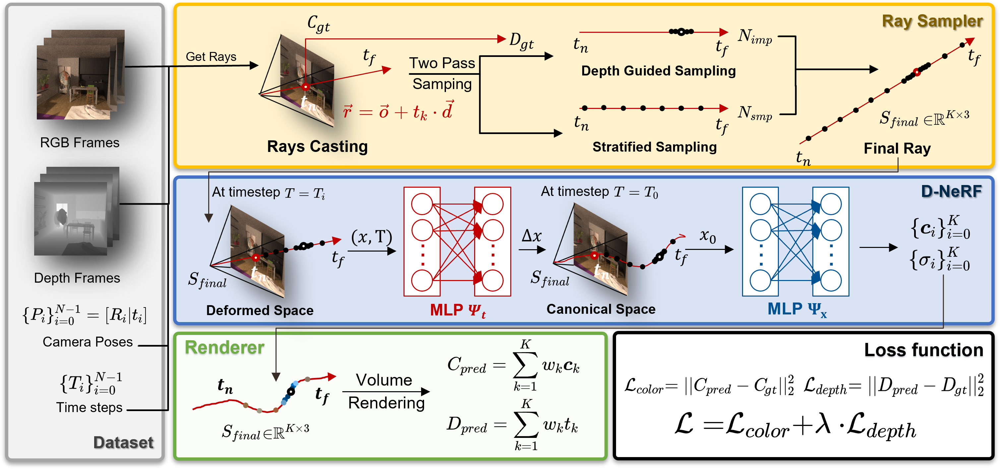
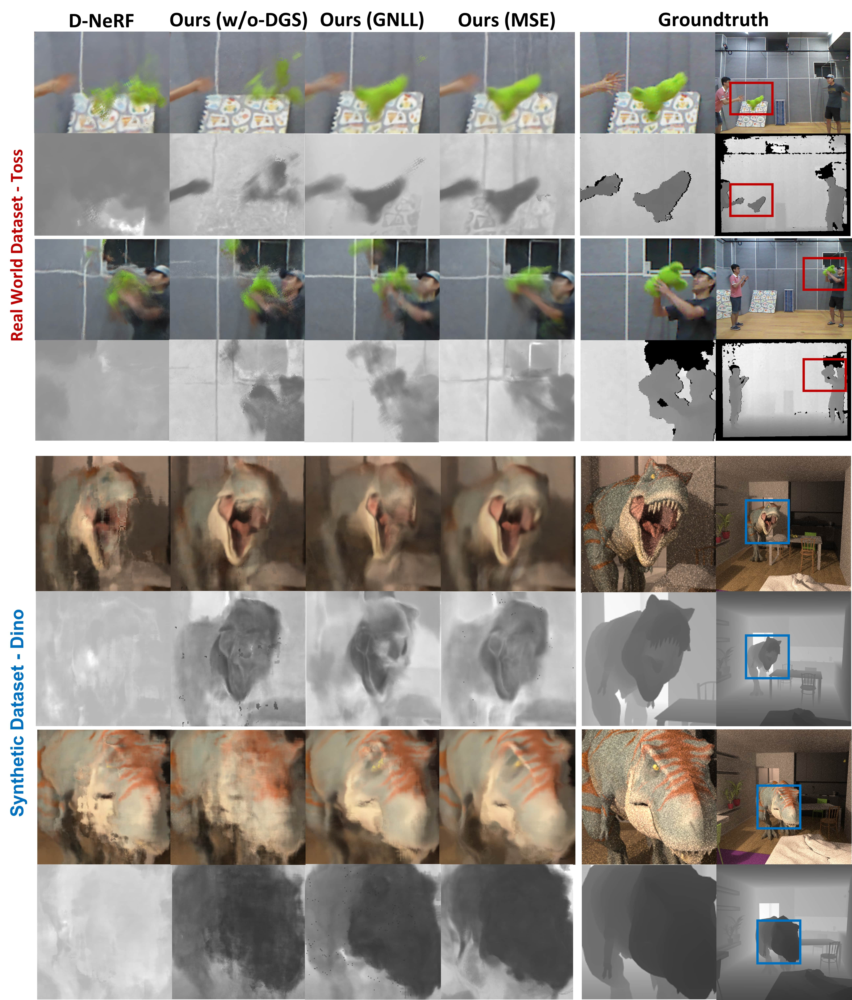

# Depth-Supervised Dynamic NeRF

ADL4CV project WS 22/23. For more details, check report [here](./docs/Depth_Supervised_Dyanamic_NeRF.pdf).

## Overview
Based on [D-NeRF implementation](), our method attempts to improve Non-Rigid NeRF methods by additionally supervising a depth term, with a dense input of depth frame, which could make the depth supervision more accurate and make the problem well-constrained. 



Starting with an RGBD-Dataset, which is composed of RGB images ${C_i}^{N-1}_{i=0}$, $C_i\in[0,1]^{H\times W\times 3}$ and Depth images ${D_i}^{N-1}_{i=0}$, $D_i \in[t_n, t_f]^{H\times W\times 1}$, where $t_n$ and $t_f$ describes the near and far plane distance of the whole scene.
Since the scene is the non-static scene, the time steps ${T_i}^{N-1}_{i=0}$, $T_i\in [0,1]$ and the camera pose ${P_i} \in SE(3)$ at the respective time step.
## Setup

0. `git clone https://github.com/netbeifeng/Depth-Supervised-Dynamic-NeRF.git`
1. `pip install -r requirements.txt`

### Build external libs

```bash
cd torchsearchsorted
pip install .
```

## Dataset

**Dino Dataset**: You can download it from [TöRF](https://github.com/breuckelen/torf).

**Toss Dataset**: You can download it from [LARR](https://haram-kim.github.io/LARR-RGB-D-datasets/).

## Train

```bash
python run.py --config ./configs/***.txt
```

## Test
```bash
python run.py --config ./configs/***.txt --render_only --render_test # Test set
python run.py --config ./configs/***.txt --render_spherical_pose # Render a series pose for a stopped time step
```

## Result

We evaluate our methods and compare it D-NeRF baseline to check the qualitative outcome and quantitative metrics. Besides, we also conduct an ablation study to check how the performance will be influenced by disabling Depth-Guided Sampling (DGS) or switching the loss function to GNLL loss. 



## Project structure
```
.
├── data
│   └── dino
│   │   ├── color
│   │   ├── depth
│   │   ├── cams
│   │   └── ...
│   └── dynamic_toss
│       ├── depth
│       ├── rgb
│       └── ...
├── model
├── logs
├── scripts
├── utils
├── requirements.txt
├── load_toss.py
├── load_dino.py
├── run.py
├── ...
└── README.md
```
## Member

Chang Luo